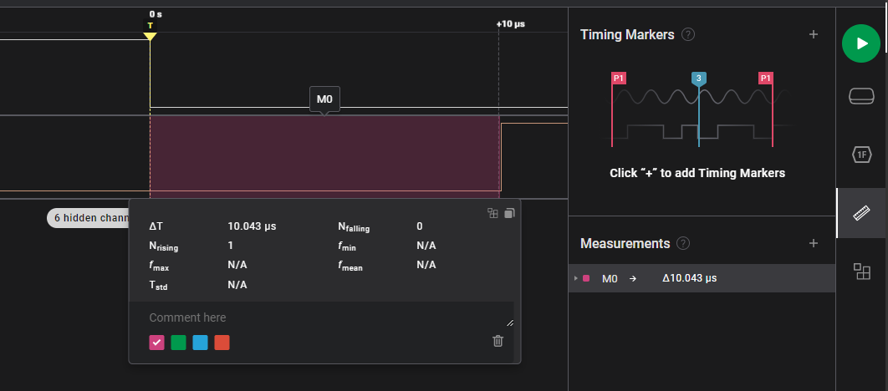

# PoC: keypad timing attack

This project features a PoC for a very simple timing attack. The goal is to 'guess' the correct PIN on the keypad without any prior knowledge. This type of attack is part of a group called side channel attacks, some very interesting stuff you can dig into. ;D

To get further infos on setup and the attack read the "[how the attack works](./docs/the_attack.md)".

## materials
**hardware**
- Arduino UNO (or other model)
- Logic Analyser
- breadboard
- 3x4 keypad
- 3 colored LEDs
- 220Ω resistor
- a lot of jumper wires

**software**
- Arduino IDE
- SALEAE Logic 2

## setup/wiring
Because we use a 4x4 button matrix, but don't need the row with letters we can ignore the 8. pin (blue wire) comming from the keypad.

Flash the [code](base_keypad.ino) to the microcontroller and you are ready to go!

> Note: The serial console can be used to see the I/O.

## attack
Configure Logic to wait for a trigger and capture afterwards.
- hide not needed channels and rename (optional)  

*> Device Settings > Trigger*
- select channel
- falling edge
- capture time = 1s

After capturing a sample, measure the time from the falling edge to the rising edge of the LED.  
*> Timing Makers > Measurements > add measurement*

Now you can perform some measurements. Enter a bunch of random pins and see what the average time without a correct digit is. Afterwards you can start testing the digits for the first number one by one, if the time delta gets larger you know the digit is correct. Loop through this process for all digits in the pin.

[my measurments](./measurements/plain_measuring.md)  
If you have a better logic analyser your measurments might not have the noise I captured with my crappy one.

**example**  
Let's measure for the first digit.

digit | time delta
--- | ---
0000   | 9,808µs
1000   | 10,063µs
2000   | 9,846µs
3000   | 9,846µs

From the samples we can see that the first digit has to be a 1 because the time of the check increased. Next we would try the same with the next digit.  
Inputting: 1000, 1100, 1200, ...

## fixing it
I can think of two methodes of fixing the issue:  

**random delays**  
If a random delay between the check and the output is implemented the time delta will not contain any information about the pin and the attack will not be possible.

[code](./code/delays_keypad_code/delays_keypad_code.ino)  
[measurements](./random_delay_measured.md)

**check the whole pin**  
If the compare function light up the result LEDs after the whole pin is checked the run time should be static and the flaw therefore gone.

[code](./code/full_check_keypad_code/full_ckeck_keypad_code.ino)  
[measurements](./full_check_measurement.md)

It would be the best so hash the pin and compare the two hashes, however this is difficult cause the chekc is performed on a device with very low computing power and hashing functions should be slow by design to be effective.

## ideas
- automated exploitation  
With another Arduino or a Raspberry the input on the keypad could be automated by splicing on the wire (the breadboard) to the keypad. If Logic has a very good API the time measurement could be performed there if not a logic analyser could be emulated with a Microcontroller (Arduino & Raspberry might be so slow).

    - start automated exploit
    - programm determines base time delta
    - programm probes for first digit
    - loop until an output on the green LED is detected